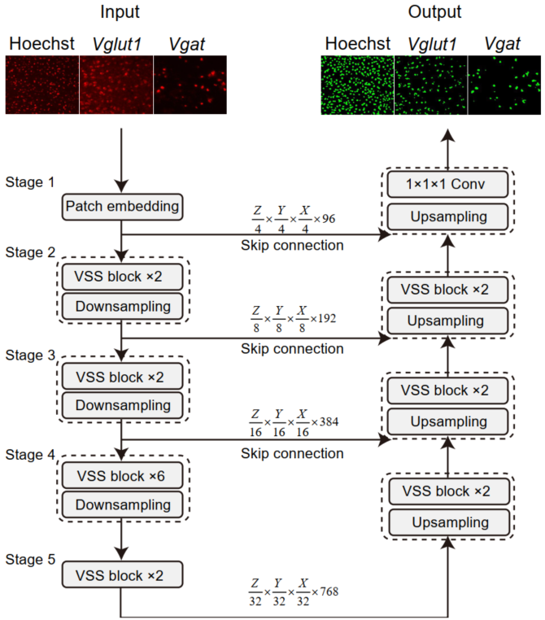

# VUSMamba

## Self-supervised learning analysis of multi-FISH labeled cell-type map in thick brain slices

  Weijie Zheng, Yiping An, Kang Li, Jinyue Wang, Huawei Mu, Jin Tang and Hao Wang.

### Architecture

This project is based on Mamba ([code](https://github.com/state-spaces/mamba)), VMamba ([code](https://github.com/MzeroMiko/VMamba)) and Swin-Transformer ([code](https://github.com/microsoft/Swin-Transformer)) thanks for their excellent works.